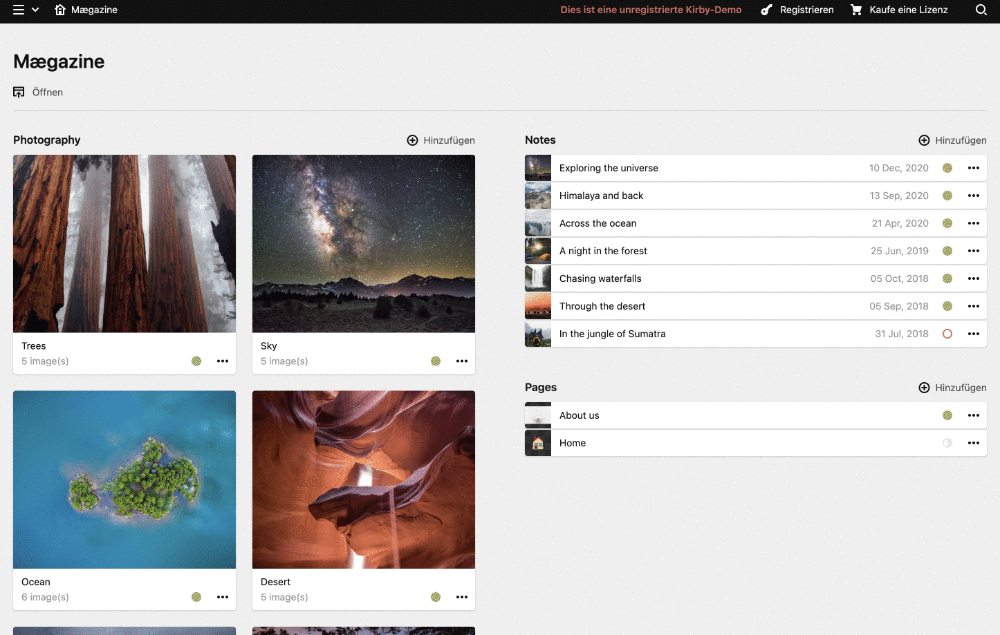

# Kirby3 plugin: Responsive images

This plugin provides a custom panel for your kirby installation to add breakpoints and image resolutions for your templates
to have full control over your rendered images. The plugins generates a JSON file holding your configuration to your desired path.
To set the path and other options, please see the [Options](#options) section in this README file.

> This plugin is completely free and published under the MIT license. However, if you are using it in a commercial project and want to help me keep up with maintenance, please consider [making a donation of your choice](https://www.paypal.me/nerdcel).

## Installation

### Download

Download and copy this repository to `/site/plugins/responsive-images`.

### Git submodule

```
git submodule add https://github.com/nerdcel/kirby3-responsive-images.git site/plugins/responsive-images
```

### Composer

```
composer require nerdcel/kirby3-responsive-images
```

## Setup



### Template

```php
<?php responsiveImage(string 'teaser-home-cover', File $page->cover(), string 'optional-css-class', bool true, string 'Alt text', string 'webp');  ?>
```

### Output

```html
<picture>
  <source srcset="/media/pages/photography/trees/9888d3c6b0-1674556128/monster-trees-in-the-fog-1536x1536-crop-1.jpg" width="1536" height="1536" media="(min-width: 1440px) and (-webkit-min-device-pixel-ratio: 1.5), (min-width: 1440px) and (min-device-pixel-ratio: 1.5)">
  <source srcset="/media/pages/photography/trees/9888d3c6b0-1674556128/monster-trees-in-the-fog-1024x1024-crop-1.jpg" width="1024" height="1024" media="(min-width: 1440px)">
  <source srcset="/media/pages/photography/trees/9888d3c6b0-1674556128/monster-trees-in-the-fog-1080x1080-crop-1.jpg" width="1080" height="1080" media="(min-width: 720px) and (-webkit-min-device-pixel-ratio: 1.5), (min-width: 720px) and (min-device-pixel-ratio: 1.5)">
  <source srcset="/media/pages/photography/trees/9888d3c6b0-1674556128/monster-trees-in-the-fog-720x720-crop-1.jpg" width="720" height="720" media="(min-width: 720px)">
  <source srcset="/media/pages/photography/trees/9888d3c6b0-1674556128/monster-trees-in-the-fog-960x355-crop-1.jpg" width="960" height="355" media="(min-width: 480px) and (-webkit-min-device-pixel-ratio: 1.5), (min-width: 480px) and (min-device-pixel-ratio: 1.5)">
  <source srcset="/media/pages/photography/trees/9888d3c6b0-1674556128/monster-trees-in-the-fog-640x237-crop-1.jpg" width="640" height="237" media="(min-width: 480px)">
  <source srcset="/media/pages/photography/trees/9888d3c6b0-1674556128/monster-trees-in-the-fog-720x267-crop-1.jpg" width="720" height="267" media="(min-width: 0px) and (-webkit-min-device-pixel-ratio: 1.5), (min-width: 0px) and (min-device-pixel-ratio: 1.5)">
  <source srcset="/media/pages/photography/trees/9888d3c6b0-1674556128/monster-trees-in-the-fog-480x178-crop-1.jpg" width="480" height="178" media="(min-width: 0px)">
  
</picture>
```

## Options

The following options are available to be set using your site/config/config.php

```php
'nerdcel.responsive-images' => [
    'cache' => true,
    'configPath' => kirby()->root('content'),
    'configFile' => 'responsive-img.json',
    'quality' => 75,
    'defaultWidth' => 1024,
    'allowedRoles' => [
        'admin'
    ],
    'cropDriver' => function ($file, $options) {
        return $file->focusCrop(
            $options['width'],
            $options['height'],
            [
                'quality' => $options['quality'],
                'upscale' => $options['upscale'],
                'format' => $options['format'],
            ]
        );
    }
]
```

### Image driver
In favor of the upcoming Kirby 4 release, the "crop" driver is now a callback function. This allows you to use any cropping driver you want.
For example if you are using the flokosiol/kirby-focus plugin, you can use the driver shown above.
In general the driver expects a callback function with the following signature:
```php
function (File $file, array $options) {
    // do something with the file and return it
}
```

## Development

Frontend components are based on kirby's internal UI Kit. Development works using the kirbyup npm module.
To start developing simply run the following cmd from the plugin root:
```shell
npm run dev
```

If that doesn't work, rund ```npm install``` first.

## License

MIT

## Credits

- [Marcel Hieke](https://github.com/nerdcel)
