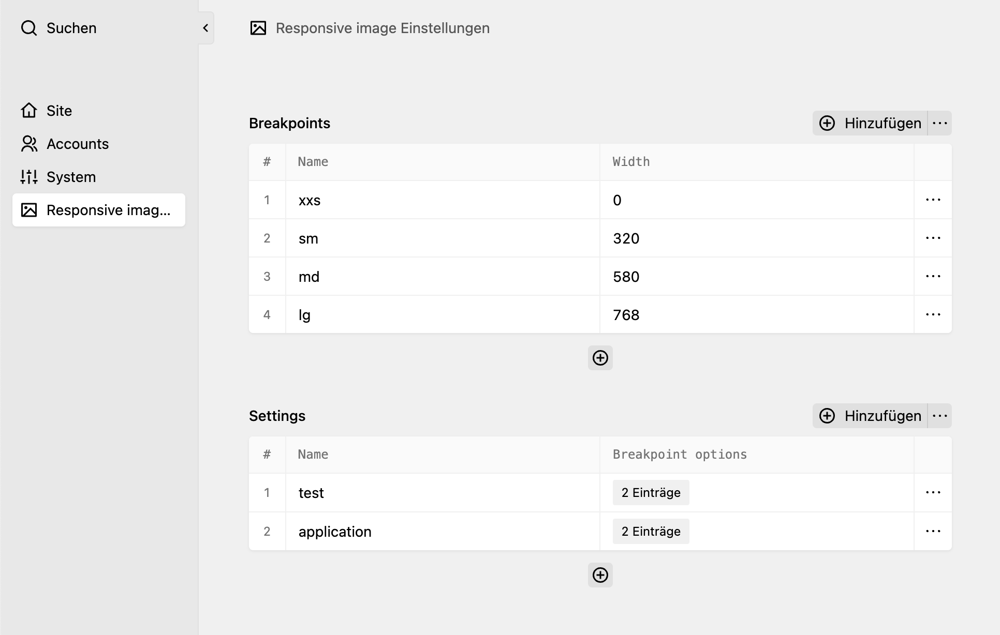
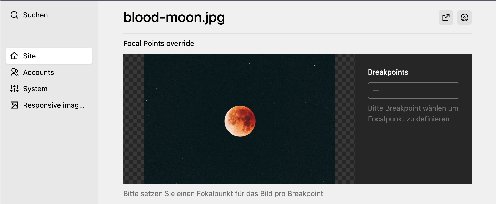

# Responsive Images Plugin




This plugin provides functionality to generate responsive images in your Kirby CMS projects.

## Installation

1. **Using Composer**:
   ```sh
   composer require nerdcel/responsive-images
    ```
2. **Manually**: Download the [latest release](https://github.com/nerdcel/kirby3-responsive-images/releases/latest)
    and copy the contents of the into your `site/plugins/responsive-images` folder.

## Configuration

You can configure the plugin by adding the following options to your `config.php` file. Consider using the "ready" hook inside the kirby config if you are
calling the kirby() function to set the configPath.

```php
'ready' => function ($kirby) {
    return [
        'nerdcel.responsive-images' => [
            'configPath' => kirby()->root('content'),
            'configFile' => 'responsive-img.json',
            'quality' => 75,
            'defaultWidth' => 1024,
            'allowedRoles' => ['admin'],
        ],
    ];
}
```

If you open the panel now, the plugin should have generated an empty json file with the following content:
```json
{"breakpoints": [], "settings": []}
```

## Usage
Generating Responsive Images
To generate a responsive image, use the makeResponsiveImage method:

```php
use Nerdcel\ResponsiveImages\ResponsiveImages;
use Kirby\Cms\File;

$responsiveImages = ResponsiveImages::getInstance();
$imageTag = $responsiveImages->makeResponsiveImage(
    'settings-slug',
    $file, // instance of Kirby\Cms\File
    'custom-classes',
    true, // lazy loading
    'Alt text',
    'webp'
);

echo $imageTag;
```

But there is also a helper function that you can use to generate responsive images:

```php
echo responsiveImage('settings-slug', $file, 'custom-classes', true, 'Alt text', 'webp');
```

## Focal Point
You can set the focal point(s) of an image for different viewports by adding the following fields to the image file blueprint:

```yaml
...
fields:
  focalpoints:
    label: Focal Points override
    type: focalpoints

```



License
This plugin is licensed under the MIT License. See the LICENSE file for more details.
