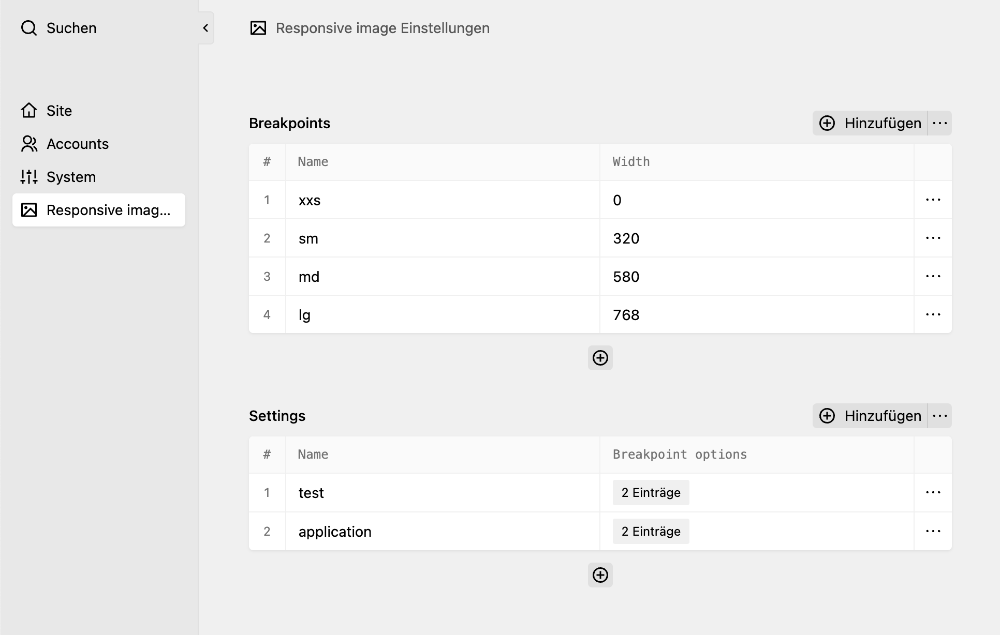
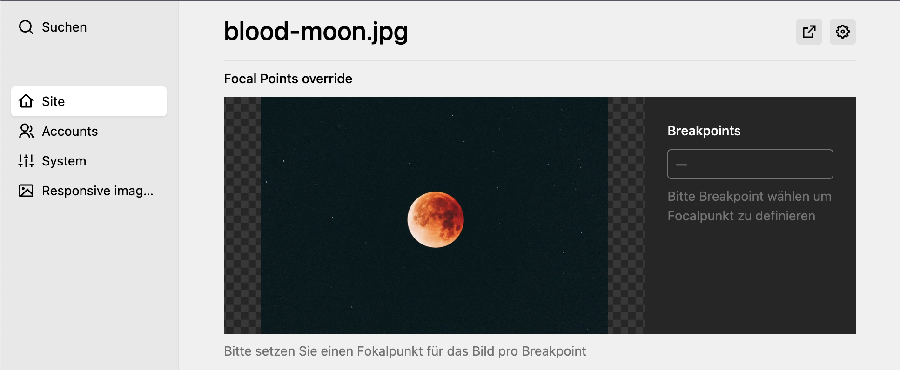

# Responsive Images Plugin




This plugin provides functionality to generate responsive images in your Kirby CMS projects.

## Installation

1. **Using Composer**:
   ```sh
   composer require nerdcel/kirby3-responsive-images
    ```
2. **Manually**: Download the [latest release](https://github.com/nerdcel/kirby3-responsive-images/releases/latest)
    and copy the contents of the into your `site/plugins/responsive-images` folder.

## Configuration

You can configure the plugin by adding the following options to your `config.php` file. Consider using the "ready" hook inside the kirby config if you are
calling the kirby() function to set the configPath.

```php
'ready' => function ($kirby) {
    return [
        'nerdcel.responsive-images' => [
            'configPath' => kirby()->root('content'),
            'configFile' => 'responsive-img.json',
            'quality' => 75,
            'defaultWidth' => 1024,
            'allowedRoles' => ['admin'],
        ],
    ];
}
```

If you open the panel now, the plugin should have generated an empty json file with the following content:
```json
{"breakpoints": [], "settings": []}
```

## Usage
Generating Responsive Images
To generate a responsive image, use the makeResponsiveImage method:

```php
use Nerdcel\ResponsiveImages\ResponsiveImages;
use Kirby\Cms\File;

$responsiveImages = ResponsiveImages::getInstance();
$imageTag = $responsiveImages->makeResponsiveImage(
    'settings-slug',
    $file, // instance of Kirby\Cms\File
    'custom-classes',
    true, // lazy loading
    'Alt text',
    'webp'
);

echo $imageTag;
```

But there is also a helper function that you can use to generate responsive images:

```php
echo responsiveImage('settings-slug', $file, 'custom-classes', true, 'Alt text', 'webp');
```

## Focal Point
You can set the focal point(s) of an image for different viewports by adding the following fields to the image file blueprint:

```yaml
...
fields:
  focalpoints:
    label: Focal Points override
    type: focalpoints

```



## AI Hint

You can mark files as AI generated and let editors display a configurable hint text overlay on top of the
responsive image. Add the `aihint` field to the file blueprint:

```yaml
...
fields:
  aihint:
    label: AI hint
    type: aihint
    text: AI generated image      # default text, overridable by the editor
    position: bottom-right        # default position: top-left, top-right, bottom-left, bottom-right
    color: '#ffffff'               # default font color, overridable by the editor
    size: 5                        # default text size as % of the image height (1-15), overridable by the editor
    opacity: 100                   # default text/backdrop opacity in percent (0-100)
    margin: 0.6                    # default distance between the hint box and the image edge, in em (0-5)
    padding: 0.5                   # default space between the hint text and its backdrop box, in em (0-2)
```

Editors can enable the hint per file, override the text, choose the position (native select), font color
(color picker), text size (slider, 1-15% of the image height), opacity (slider, 0-100%), the edge margin
(slider, 0-3em) and the backdrop padding (slider, 0-2em) directly in the panel using Kirby's native toggle,
text, select, color and range inputs. The AI hint field itself shows a live preview directly on the image
that reacts instantly to every input change, and the focal points field also shows the same accurate
preview on top of the real image. The backdrop box has rounded corners and its background color is chosen
automatically (black or white) to contrast with the chosen font color, both in the panel preview and in the
final burned-in image.
Any option left untouched by the editor falls back to the blueprint defaults, which in turn fall back to the
plugin's global configuration. The values are stored as plain YAML in the content file, just like Kirby's
own structure/object fields (no JSON involved):

```php
'ready' => function ($kirby) {
    return [
        'nerdcel.responsive-images' => [
            'aiHint' => [
                'text' => 'AI generated image',
                'position' => 'bottom-right',
                'color' => '#ffffff',
                'size' => 5,
                'opacity' => 100,
                'margin' => 0.6,
                'padding' => 0.5,
            ],
        ],
    ];
}
```

When enabled, editors get a live preview of the hint (text, position, color, size, opacity, margin and
padding) directly in the panel while editing the `aihint` field and the focal points field. The font size
scales proportionally to the rendered image **height** (using CSS container query block-size units)
according to the editor-selected percentage (1-15%, defaulting to 5%), so it stays legible and consistently
proportioned across every responsive breakpoint.

The hint is **not** rendered as an HTML overlay on the frontend — `responsiveImage()` /
`makeResponsiveImage()` output plain `<picture>`/`` markup without any extra wrapper or span. Instead,
the hint is only ever conveyed on the frontend by being burned directly into the generated image itself (see
below), so there is no separate stylesheet to include.

### Compliance: the hint is burned into the image, not styled with CSS

A pure CSS overlay can be removed or hidden, and disappears once the image is downloaded or reused
elsewhere — which isn't sufficient to satisfy AI content labelling obligations (e.g. Art. 50 of the EU AI
Act). To cover this, every generated thumbnail is **stamped**:

- The hint text is burned directly into the image's pixel data (position, color and proportional size
  follow the same settings as the overlay), so it stays visible even if the image is saved, shared or
  embedded outside of your site.
- For JPEGs, basic IPTC IIM metadata (keywords `AI-generated` / `KI-generiert` and a caption with the hint
  text) is embedded into the file as well, so the marking survives in the file itself and is readable by
  photo/asset management tools.
- Additionally, an XMP metadata packet is embedded into **JPEG, PNG and WebP** output (a `dc:description`
  with the hint text, plus the IPTC `DigitalSourceType` set to `trainedAlgorithmicMedia`). Unlike the
  legacy IPTC IIM block above, XMP isn't limited to JPEG, so this also covers PNG and WebP thumbnails.
  GIF and AVIF currently only get the burned-in pixels, without embedded metadata.

Stamped copies are generated once and cached alongside the regular thumbnail; they're automatically
regenerated if you change the hint text, position, color, size, opacity, margin or padding. By default, a
common regular-weight system font (e.g. DejaVu Sans, Arial) is used for the burned-in text, matching the
panel preview's normal font weight; you can point to your own `.ttf` file via the `font` option:

```php
'nerdcel.responsive-images' => [
    'aiHint' => [
        // ...
        'font' => '/path/to/your-font.ttf',
    ],
],
```

When using `makeResponsiveImageObject()` / `responseType: 'json'`, the returned object includes an additional
`aiHint` key (`{ text, position, color, size, opacity, margin, padding }` or `null` when disabled) so you can render your own overlay markup.

License
This plugin is licensed under the MIT License. See the LICENSE file for more details.
